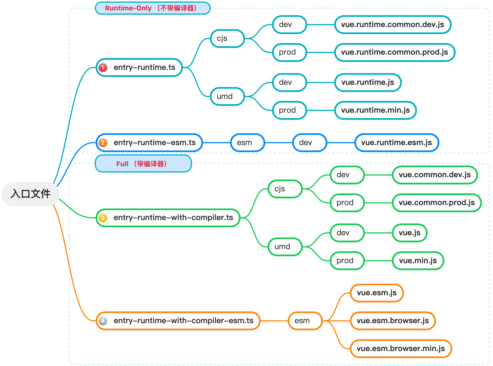
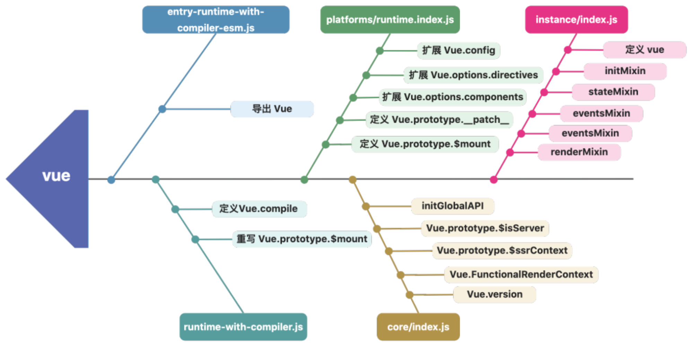
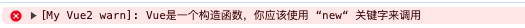

🔥从零手写vue2 - 窥探入口 && 源码构建

[专栏文章一 - 🔥从零手写vue2 - 虚拟节点以及createElement函数](https://juejin.cn/post/7421103437607370806)

[专栏文章二 - 🔥从零手写vue2 - template模板解析](https://juejin.cn/post/7427468776995012627)

[专栏文章三 - 🔥从零手写vue2 - 源码目录结构](https://juejin.cn/spost/7428128754571116583)

本专栏是打算从零手写一个 vue2，并学习 vue2 中的一些核心理念。

目前我们已经实现了下面的目录。

```js
my-vue2
├─shared
|   └util.js 
├─platforms
|     ├─web
|     |  ├─compiler
|     |  |    └index.js
├─core
|  ├─vdom
|  |  ├─create-element.js
|  |  └vnode.js
|  ├─util
|  |  ├─index.js
|  |  └lang.js
├─compiler
|    ├─index.js
|    ├─parse
|    |   ├─html-parser.js
|    |   └index.js
|    ├─codegen
|    |    └index.js
```

# 一、Full（带编译器） && Runtime-Only（不带编译器） 模式

## 1.1 打包文件的讲究

在上一节课中，我们熟悉了 vue源码中的代码结构。

其中我们介绍了几个入口文件：

1. `entry-runtime.ts`
2. `entry-runtime-with-compiler.ts`
3. `entry-runtime-esm.ts`
4. `entry-runtime-with-compiler-esm.ts`

在我们开发项目结束后，需要进行打包并部署到线上。

通常我们打包时需要一个入口文件，然后通过 webpack 递归文件进行依赖分析然后打包。

其实框架也一样，同样需要一个入口文件进行递归依赖分析打包生成 js文件方便我们进行使用。

而上面的这四个文件就是vue框架的入口文件。

> vue是使用rollup进行打包的。

为了方便用户进行使用，vue在打包时根据`开发环境`和`开发模式`打包出了不同功能的文件，适用于不同的使用场景。



总共打包生成 12 个文件，这些文件可以适用于不同的场景。

1. 根据是否带编译器的角度上分为Full和Runtime-Only 2个版本。Full版本包含```编译器和运行时```的全部功能。Runtime-Only 仅含```运行时功能```。
2. 打包的文件根据使用场景分为 esm、cjs、umd三个版本。其中umd可以通过`<script>`标签引入直接在浏览器中使用，Vue会暴露一个全局变量 Windows.Vue。而 CommonJS适配`const Vue = require('vue')`这种 node式的模块系统。ES则适配`import Vue from 'vue'`这种es6格式。
3. 打包的文件根据环境分为  `dev/prod`，在开发环境中可以使用 dev版本的 js文件，而部署到客户生产环境就可以使用 prod版本的 js文件。 dev版本的文件有一些提示，会在开发者开发时便于调试。


## 1.2 Full版本的vue到底是什么意思？


平时我们开发中只使用了 runtime-only 版本。

而 Full版本中不仅有 runtime-only部分，还包括编译器部分。

所谓编译器，就是在 vue内部的编译器可以将模板转化为对应的render函数。

也就是我们在[专栏第二节](https://juejin.cn/post/7427468776995012627)实现的模板编译。 

因为编译器代码体积比较大，而且如果在运行的时候进行模板编译，极大可能会消耗性能。

所以我们一般在开发项目时，使用 runtime-only版本。

在 webpack预编译阶段，就将`.vue文件`编译成render函数，在运行时直接运行 render函数就可以获取到对应的 vnode。

> 通过 runtime-only 和 esm很容易推测出来我们项目在开发阶段中使用的是`vue.runtime.esm.js`

## 1.3 是用 Full 还是用 Runtime-only ？

这需要依据具体情况进行具体分析。

倘若你需要用到 Vue 所提供的 html 模板功能，那就选用 Full 版本。

反之，最好采用 Runtime-only 版本，原因在于它比 Full 版本的文件体积大约小 30%。

> *.vue 单文件组件会被 vue-loader 直接构建成为 JavaScript，并未使用到 Vue 的编译器，所以可以使用 Runtime-only 版本。

# 二、窥探入口目录结构

此专栏是实现的Full版本的 vue，所以我们需要以`entry-runtime-with-compiler-esm.ts`为入口进行探索，并建立相应文件。

## 2.1 新建 `platforms/web/entry-runtime-with-compiler-esm.js`文件

```js
import Vue from "./runtime-with-compiler";

export default Vue;
```
设计了一个通用文件`runtime-with-compiler`文件方便2 个入口文件引入。

可以看到就是引入了 `runtime-with-compiler`并导入。

## 2.2 新建 `platforms/web/runtime-with-compiler.js` 文件

```js
import Vue from "./runtime/index"

// 中间对 Vue 进行了一些操作 暂时先省略

export default Vue;
```

在此文件中:
1. Vue上扩展了定义了Vue.compile 
2. 重写了 Vue.prototype.$mount

可以看到就是引入了`platforms/web/runtime/index`文件并导出。

## 2.3 新建 `platforms/web/runtime/index`

```js
import Vue from '@/my-vue2/core/index'

// 对 vue进行了一些扩展属性的操作

export default Vue
```

在此文件中:
1. 定义了Vue.prototype.$mount
2. 定义了Vue.prototype.__patch__
3. 扩展了扩展 Vue.config一些属性
4. 扩展 Vue.options.directive
5. 扩展 Vue.options.components

可以看到就是引入了`core/index`文件并导出。 
 
## 2.4 新建 `core/index`文件

```js
import Vue from './instance/index'

// 扩展了vue的一些属性

export default Vue
```

在此文件中:
1. 使用了initGlobalAPI定义了一些全局方法 如 mixin
2. 定义了Vue.prototype.$isServer
3. 定义了Vue.prototype.$ssrContext
4. 定义了Vue.FunctionalRenderContext
5. 定义了Vue.version

可以看到就是引入了`core/instance/index`文件并导出。 

> 对引入的 Vue对象进行了属性扩展等操作。这里先不研究，后续会慢慢补充进去。

## 2.5 新建`core/instance/index`文件

```js
function Vue(options) { 
    // 暂时省略
}

export default Vue; 
```

如instance这个名字一样，这个文件在 Vue原型 上定义了一些方法。

在此文件中:
1. 使用 initMixin 注入了 初始化有关的属性如：Vue.prototype.$init
2. 使用 stateMixin 注入了 跟状态有关的属性如：Vue.prototype.$set、Vue.prototype.$watch、Vue.prototype.$delete
3. 使用 eventsMixin 注入了 跟事件有关的属性如：Vue.prototype.$on、Vue.prototype.$off、Vue.prototype.$once
4. 使用 lifecycleMixin 注入了 跟整个 vue生命周期更新有关的属性如：Vue.prototype.$update
5. 使用 renderMixin 注入了 跟渲染相关的属性如：Vue.prototype._render

历经千辛万苦，终于看见了 Vue真正被定义的地方。

他实际上就是一个用 Function实现的构造函数。

## 2.6 为什么vue要这么设计目录结构



在上小节中，我们发现了 `instance/index.js`中定义了 Vue构造函数。

我们可以看到每个模块都对 Vue对象做了相应的处理，比如说扩展属性、扩展实例属性等。

Vue 按功能把这些扩展分散到多个模块中去实现，而不是在一个模块里实现所有。

这种技巧便于后期vue的维护和迭代。

# 三、Vue是一个构造函数

## 3.1 为什么vue不是一个class

上面我们在 `instance/index.js` 文件中发现了Vue被定义的地方：

```js
function Vue(options) {
  if (__DEV__ && !(this instanceof Vue)) {
    warn('Vue is a constructor and should be called with the `new` keyword')
  }
  this._init(options)
}
```

我们在使用的时候使用 new Vue() 进行实例化。

那么 vue源码中为什么不使用 class呢？
 
Vue中有大量的扩展实例属性的操作如：`Vue.prototype.$mount=xxx`。

其实本质上类只是function的语法糖。

虽然说使用类也可以进行扩展：

```js
class Animate{
}
Animate.prototype.eat = function(){
    console.log("动物吃东西")
}
new Animate().eat();// 动物吃东西
```

但是用类和原型这么混合使用，难免会让人感到不适，也算是一种开发规范和习惯吧。

大部分开源库依旧使用的是 function。

## 3.2 神奇的“__DEV__”

### 3.2.1 __DEV__的本质

可以看到在入口文件中存在`__DEV__`这个变量。

实际上__DEV__变量贯穿在 Vue源码中，但是你找不到在哪里定义了这个变量。

这个变量在 vue 中代表开发环境。当`if(__DEV__)`代表这个 if中的逻辑只有在开发环境才进入执行。

vue的构建工具是rollup，在rollup打包的时候会使用`@rollup/plugin-replace `插件来替换源代码中的 `__DEV__` 变量，如下：

```js
......
const replace = require('@rollup/plugin-replace')
......
// built-in vars
const vars = {
    ......
    __DEV__: `process.env.NODE_ENV !== 'production'`,
    ......
}
......
config.plugins.push(replace(vars))
......
```

所以__DEV__的本质就是 `proess.env.NODE_ENV!== 'production'` 。 

### 3.2.2 约定俗成的“process.env.NODE_ENV!=='production”

将 __DEV__ 变量转换为 `process.env.NODE_ENV !== 'production'` 这样的条件表达式在现代前端构建工具中是一种常见的约定和实践。

原因有以下几点：

1. `环境区分`：通过 `process.env.NODE_ENV` 可以方便地在代码中区分开发环境（development）与生产环境（production）。例如，在开发环境中启用特定的警告、日志记录或者热加载功能；而在生产环境中则禁用这些功能以优化性能。
2. `Tree-shaking 和 UglifyJS`：当打包工具如 Rollup 或 webpack 遇到 `process.env.NODE_DEV !== 'production'` 包裹的代码块时，在生产环境下会自动去除（tree-shake）其中仅在开发环境中需要的代码，因为该条件表达式最终会被编译器或压缩工具识别为始终为 false，因此包裹的代码不会被打包进最终产物。
3. `标准化`：许多框架和库都采用了这种模式来处理环境相关的逻辑，这样开发者可以统一遵循这个约定，减少配置和理解成本。
4. `灵活配置`：由于构建工具支持 .env 文件或其他方式来设置 NODE_ENV 的值，这使得项目配置更加灵活，团队成员可以根据实际需求快速切换不同环境下的行为。
5. `跨平台兼容性`：`process.env.NODE_ENV` 作为一个标准 Node.js 环境变量接口，已经被广泛接受，并且在各种打包工具中都有相应的机制将其映射到最终浏览器执行的代码中，确保了跨平台的一致性。

> 一般项目在开发环境中将process.env.NODE_ENV设置为`development`，在生产环境中设置为`production`。
>
> 所以通过`process.env.NODE_ENV !== 'production`就可以判断现在是处于什么环境下。


### 3.2.3 在本地环境配置__DEV__

因为我们这门课程是写一个完整版的vue2。

所以我们也会使用__DEV__这个变量代表开发环境。

我们本地的项目是使用 vue-cli 搭建的。

可以在 webpack配置文件 vue.config.js 文件新增一个配置达到这个目的。

```js
// vue.config.js
const { defineConfig } = require('@vue/cli-service');
const webpack = require('webpack');
module.exports = defineConfig({
  transpileDependencies: true,
  lintOnSave:false,
  configureWebpack: {
    plugins: [
      new webpack.DefinePlugin({
        __DEV__: process.env.NODE_ENV === 'development',
      }),
    ],
  },
})
```
> DefinePlugin 插件的主要作用是在编译时将预定义的值替换到源代码中的特定变量。

我们执行`yarn start`启动这个项目打印一下__DEV__为 true即为成功。

```js
console.log(__DEV__); // true
```

## 3.3 noop 函数

在 vue源码中，默认初始化一个空函数（noop）非常常见。

如下面的warn工具函数在初始化时就被初始化为 noop。

```js
// 可以提示的作用
export let warn = noop
```
这么做的目的是为了`延迟配置`，可以允许用户在初始化框架之后，根据需要再添加具体的逻辑。

如这里的warn函数就是在开发环境时重新赋值函数具体的逻辑，所以在生产环境下这个函数就是一个空函数，执行时什么也不会发生。

可能你会有疑问，那么我这里直接不赋值不可以吗？

如果不赋值的话，当你不小心在生产环境下执行这个 warn函数，会报undefined 错误，初始化为 noop 可以防止这种情况发生。

这个函数定义在`shared/util.js`中：

```js
//shared/util.js
export function noop(a, b, c) {}
```
## 3.4 warn工具函数

warn是一个工具函数，用于提醒开发者在开发中存在报错信息。

这个函数定义在`core/util/debug.js`中，初始化时被赋值为一个空函数。

在开发环境被重新赋值逻辑。

```js
import { noop } from "@/my-vue2/shared/util";

export let warn = noop

if(__DEV__){
    warn = (msg) => {
        const hasConsole = typeof console !== 'undefined'
        if(hasConsole){
            console.error(`[My Vue2 warn]: ${msg}`) 
        }
    }
}
```

可以看出来`warn函数`就是调用了 `console.error`。

> 内部其实还有一些逻辑 我们会在后续的章节中补充 暂时我没还没学到 在后面的章节中我们会慢慢补充

## 3.5 必须使用new 关键字来调用

可以看到在 Vue构造函数内部存在一个判断 `this instanceof Vue`，那么这行代码应该如何理解呢？

我们知道通过 instanceof可以顺着原型链向上查找对应的构造函数。

所以这个判断的意思就是检查当前上下文（this）是否是一个 Vue实例。

如果不是一个实例，就会给你一个警告。

告知开发者 Vue应该要作为一个构造函数来使用。

```js
// instance/index.js
function Vue(options) { 
    if(__DEV__ && !this instanceof Vue){
        warn('Vue是一个构造函数，你应该使用 “new“ 关键字来调用')
    }
}
```

假设你这么使用 Vue：

```js
const vm = Vue()
```

那么你将会在控制台看到一条报错信息。



在 new Vue 的时候其实还有一些初始化的工作，这些内容也是比较多的，我们会单独开一章进行讲解。

# 四、总结

本文介绍了 Vue的源码构建对应的四个入口文件 以及打包产物的不同，然后介绍了 Vue的本质，就是一个构造函数。
 

[本节 手写vue2项目（持续更新）完整代码 github地址](https://github.com/parrot-designa/learn-vue2-entry)